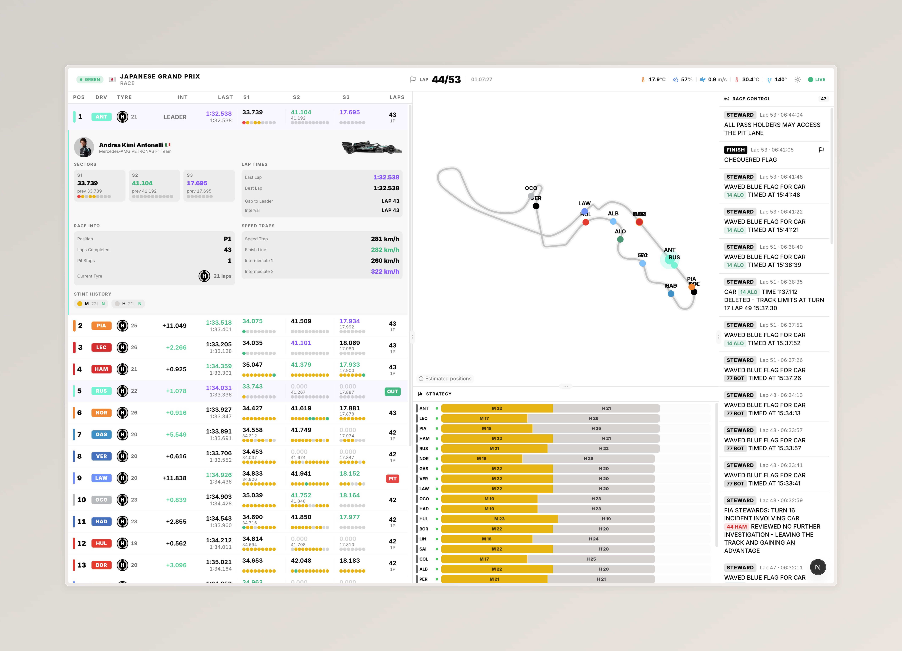

# F1 Telemetry

An open-source real-time dashboard for Formula 1 live timing and telemetry data.



> More screenshots: [Desktop](apps/frontend/public/images/desktop_2.jpeg) · [Tablet](apps/frontend/public/images/tablet.jpeg) · [Mobile](apps/frontend/public/images/mobile_1.jpeg)

## Overview

F1 Telemetry connects directly to the F1 Live Timing SignalR feed — the same stream that powers the official timing screens during race weekends — decodes the payload in real time, and serves it over WebSocket to a browser-based analytics dashboard.

The goal is to give anyone a clean, fast, and accurate view into what is happening on track during any F1 session.

## Features

- **Timing Tower** — full leaderboard with positions, gaps, intervals, sector times, micro-sector segments, pit stops, tyre compounds and driver status. Multi-key sorting with tie-breaking and sequential position remapping to eliminate duplicate positions from the F1 feed
- **Track Map** — real-time driver positions on an interactive SVG circuit map with curvature-weighted segment boundaries, forward projection between micro-sector anchors, and smooth 60fps interpolation via `requestAnimationFrame` with direct DOM manipulation
- **Race Strategy** — tyre stint timeline showing compound, lap count, and mandatory stop indicator (FIA B6.3.6 compliance). Session-aware with cumulative stint positioning
- **Pace Radar** — speed trap and sector time rankings with all active drivers, position badges, tyre compound icons, and single-purple enforcement for the overall best
- **Race Control** — live feed of official messages, flags, safety car deployments, and steward decisions
- **Weather** — air and track temperature, wind, humidity, and rainfall in real time
- **Qualifying Support** — Q1/Q2/Q3 knockout detection with elimination line and separator labels between eliminated groups
- **Data Resilience** — handles F1's lossy feed gracefully: stuck `InPit` flags are cross-referenced with stint data, `Retired`/`Stopped` states are permanently latched, and segment status `2064` (not-yet-reached) is correctly excluded from position calculations

## Broadcast Delay

The dashboard can be held back by up to three minutes so it stays in sync with your TV broadcast and does not spoil what you are watching. The UI pauses briefly while the delay buffer fills. Full guide in [docs/broadcast-delay.md](docs/broadcast-delay.md).

## Architecture

This is a [pnpm](https://pnpm.io) monorepo with three packages:

| Package    | Path            | Description                                                                                 |
| ---------- | --------------- | ------------------------------------------------------------------------------------------- |
| `backend`  | `apps/backend`  | Node.js service that connects to F1 SignalR, decodes payloads, and broadcasts via WebSocket |
| `frontend` | `apps/frontend` | Next.js analytics dashboard                                                                 |
| `core`     | `core`          | Shared TypeScript types and constants                                                       |

### Data flow

```
F1 SignalR (livetiming.formula1.com)
    └── backend (Node.js + ws)
          ├── /health  HTTP endpoint for frontend status polling
          └── ws://    WebSocket broadcast to frontend clients
```

The backend subscribes to all available F1 channels. Compressed channels (`CarData.z`, `Position.z`) are decoded with raw DEFLATE. All channels are batched in 50ms windows before broadcast to reduce WebSocket frame volume.

## Getting started

```bash
# Install dependencies
pnpm install

# Start backend and frontend in parallel
pnpm dev
```

Backend runs on `ws://localhost:8080` (WebSocket) and `http://localhost:8081/health` (HTTP health check).
Frontend runs on `http://localhost:3000`.

Environment variables are documented in `.env.example` at the project root.

### Replay mode (no live session needed)

```bash
pnpm dev:replay
```

This replays a pre-recorded session through the WebSocket server so you can develop and test the dashboard outside of race weekends. The replay server loops the recording indefinitely.

> **Note**: Replay recordings may have incomplete data depending on when the recording started. Some micro-sectors, position updates, or pit events might be missing. During a live session, the data feed is significantly more complete and the dashboard behaves more accurately.

See [docs/replay-mode.md](docs/replay-mode.md) for details on recording your own sessions and configuration options.

## Documentation

- [Broadcast delay](docs/broadcast-delay.md) — how the delay feature works, when to use it, and its current limitations
- [Replay mode](docs/replay-mode.md) — how to develop and test the live dashboard without an active F1 session
- [F1 Live Timing payload types](docs/live-timing-types.md) — field reference for all subscribed channels, 2026 regulation notes, and maintenance guide
- [Timing tower sort architecture](docs/timing-sort-architecture.md) — how the client-side classification algorithm works, FIA regulation mapping, and known stream limitations

## Contributing

See [CONTRIBUTING.md](CONTRIBUTING.md) for setup instructions, code standards, and PR guidelines.

The live timing schema is reverse-engineered and may change between seasons. See [docs/live-timing-types.md](docs/live-timing-types.md) for guidance on keeping the types up to date.

Issues and pull requests are welcome.

## Disclaimer

This project is not associated with, endorsed by, or officially connected to Formula 1, the FIA, Formula One World Championship Limited, Formula One Management, or any of their subsidiaries or affiliates. F1 and related marks are trademarks of Formula One Licensing B.V.

## License

MIT
