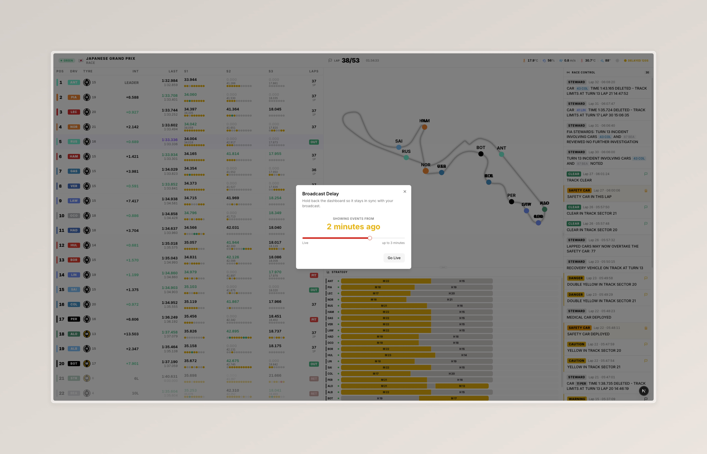

# Broadcast Delay

The broadcast delay lets you align the dashboard with your TV broadcast so you don't get spoilers. The data feed usually arrives a few seconds (to a few minutes) ahead of what you see on screen, and this feature closes that gap.

## How to use it

1. Click the **Live** badge in the top-right corner of the dashboard.
2. Drag the slider to match your broadcast's delay (for example, 30 seconds if your TV is ~30s behind).
3. The badge turns yellow and shows the active delay, e.g. `Delayed 30s`.
4. Click **Go Live** anytime to return to real-time.

## How it works

When you enable a delay of N seconds, the dashboard starts holding incoming data in a buffer instead of showing it straight away. The UI pauses on its current state. After N seconds, the buffer begins releasing events at the same pace they were received — so from that point onwards you always see events N seconds after they actually happen.

**Important**: for the first N seconds after you enable a delay, the dashboard looks frozen. That's expected — the buffer is filling up. For example, if you set a 30-second delay, the UI freezes for roughly 30 seconds before it resumes updating.

## Tips

- **Set the delay before events happen** for the cleanest experience. If you enable a delay after seeing something (like a Safety Car message), that event stays visible — the dashboard does not rewind the past.
- **Start small**: try 10–30 seconds first and adjust. Most official streams are only a few seconds behind.
- **Available history grows over time**: you can't set a 3-minute delay on a dashboard that has only been running for one minute. The slider is capped by how long the dashboard has been receiving data.

## Automatic reset

The delay is automatically reset to Live in these cases:

- A new full snapshot arrives from the server (after a reconnection or a session change).
- You leave the tab inactive for longer than your current delay window (for example, switching tabs for several minutes).

A small toast notifies you when this happens.

## Current limitations

- **No retroactive rewind**: events already shown stay visible even after enabling a delay. For best results, set the delay at the start of the session.
- **No persistence**: refreshing the page resets the delay to 0.
